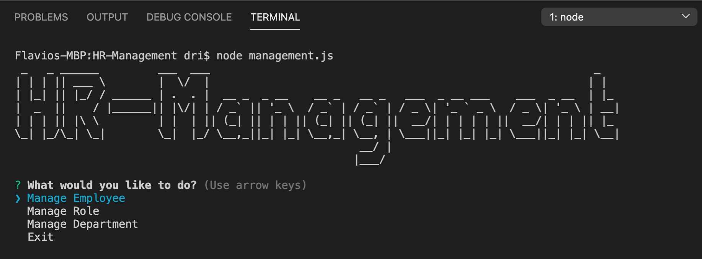
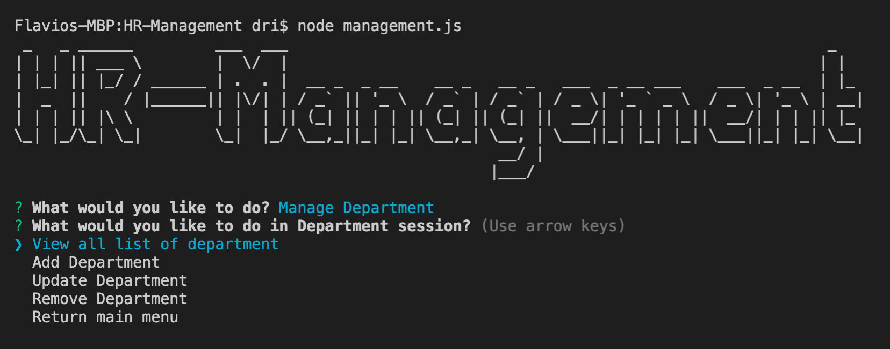
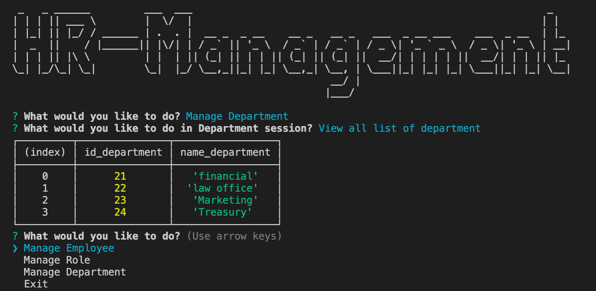
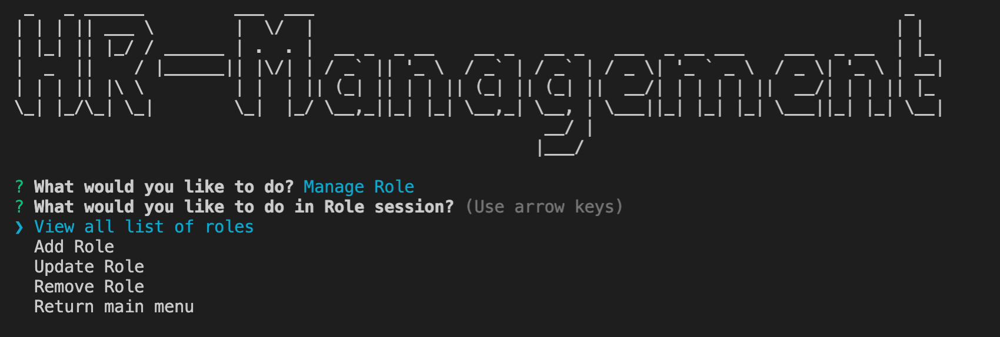
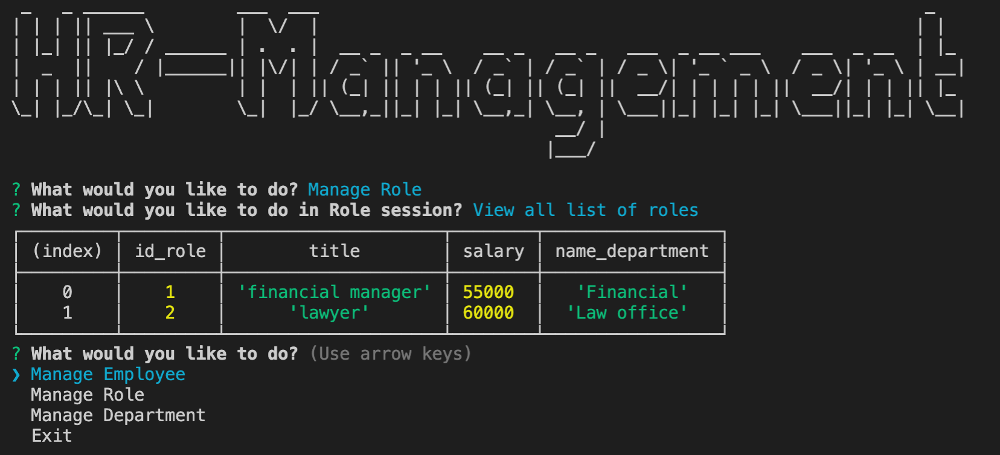
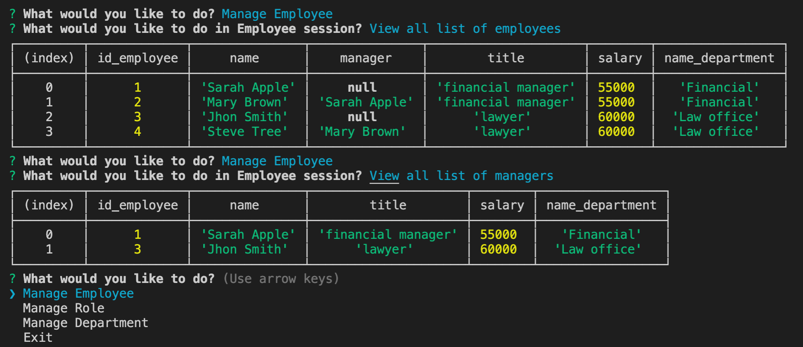
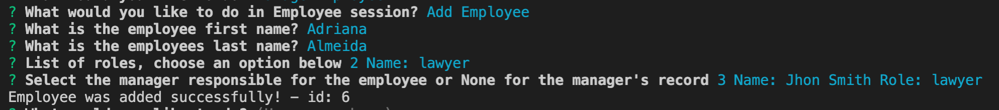

# Human Resource Management

## Table of Content
- [Description](#Description)
- [Installation](#Installation)
- [Run](#Run)
- [Database](#Database)
- [Screens](#Screens)
- [Video](#Video)

## Description
This interface is known as **C**ontent **M**anagement **S**ystems. This is a solution to manage the employees of a company using node, inquirer and MySQL.
You will be able to view all employees, departments and roles, as well as add, update and remove.

## Installation
```
npm install
npm install inquirer
npm install mysql
npm install ascii-art
```

## Run
```
node management.js
```

## Database


## Screens
** Program start with menu below and each menu there is a sub-menu:
        *** Manage Employee
        *** Manage Role
        *** Manage Department
        *** Exit


**Department Session there is a menu with the options below:**
        > View all list of departments
        > Add Department
        > Update Department
        > Remove Department
        > Return main menu

*Department Menu*


*Department List*


**Role Session there is a menu with the options below:**
        > View all list of roles
        > Add Department
        > Update Department
        > Remove Department
        > Return main menu

*Role Menu*


*List of roles*


**Employee Session there is a menu with the options below:**
        > View all list of employees
        > View all list of managers
        > Add Department
        > Update Department
        > Remove Department
        > Return main menu

*List of Employees and Managers*


*Add Employee*


## Video

<a href="https://drive.google.com/file/d/1j_yOyBP3GlNPMTH_39Z2hycCQdZ4RAqe/view" title="Link Title">*Short presentation of interface*</a>

